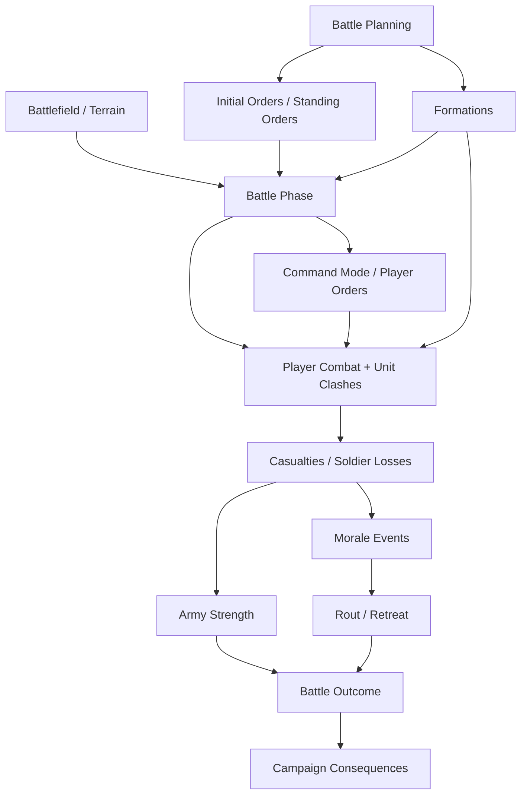
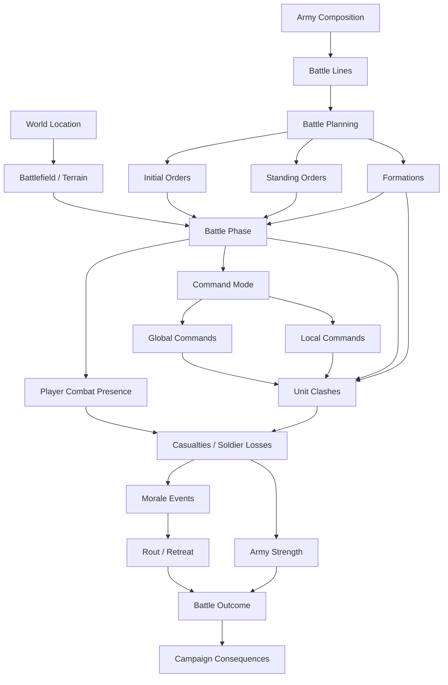

# Commanding Chaos #1

## A QA & Design Investigation into Emergent Medieval Battles

**Author:** Marco Trapani  
**Perspective:** QA professional with a Game Design background  
**Case study type:** Public QA / Design investigation  
**Reference project:** *Chronicles: Medieval* by Raw Power Games

---

## Executive Summary

This case study investigates one of the hardest problems behind large-scale medieval battles:

> **How do you let a battle feel chaotic without making it feel random?**

I am using *Chronicles: Medieval* as the reference point because Raw Power Games has publicly shown a battle fantasy built around a hybrid player role: commander, fighter, observer, morale influence, and decision-maker inside the same battle space.

From the public material, the battle experience appears to involve pre-battle planning, army deployment, unit and culture preferences, Standing Orders, Initial Orders, formations, Command Mode, real-time combat, casualties, unit-level morale, rout, retreat, and campaign consequences.

I do not have access to the build, internal documentation, debug tools, telemetry, test maps or production constraints. This is not a review of the game, a redesign proposal, or a judgement of unfinished implementation from the outside.

The goal is to show how I would approach this kind of system as QA with a design background: starting from public design intentions, identifying risks, asking practical questions, and turning those questions into validation strategies and testable investigation paths.

My core thesis is:

> **Large battles should not be tested only as separate features. They should be tested as chains of cause and effect that the player must be able to understand.**

A battle can be messy. It should probably be messy.

But the player should not feel that the game itself is confused.

---

## Hiring Takeaway

This case study demonstrates:

- systemic QA thinking
- design-intent analysis
- player-facing readability evaluation
- test case design for emergent systems
- bug taxonomy and risk classification
- observability and reproducibility planning
- the ability to turn vague player feedback into actionable QA investigation

The intended reader is not only a recruiter. The document is mainly written for QA Managers, Technical QA specialists, Game Designers, Combat Designers, Gameplay Programmers and Game Directors who want to understand how I reason through complex gameplay systems.

---

## Visual Material Note

To avoid misrepresenting ownership of Raw Power Games' material, this case study is designed to rely primarily on public material from *Chronicles: Medieval*, which is treated as reference material and cited as such. 

---

## 1. Scope

### What this case study is

This is a QA and Design investigation into emergent medieval battles.

It focuses on:

- player agency inside large battles
- readable cause and effect
- AI interpreting player intent
- formations under pressure
- casualties as both outcome and systemic input
- morale as a battle-resolution system
- scale as a design and Technical QA variable
- rout, retreat and campaign consequence
- practical QA artifacts such as taxonomy, reproducibility notes, test cases and an example bug report

### What this case study is not

This is not:

- a review of *Chronicles: Medieval*
- a prediction of final quality
- a comparison piece against *Mount & Blade*, *Total War* or *Kingdom Come*
- a redesign proposal
- a claim about Raw Power's internal implementation

From the outside, I cannot seriously say:

> "This system works."

or:

> "This system is broken."

What I can ask is:

> **Given the design direction shown publicly, where are the main QA and design risks?**

That is the level of analysis this document uses.

---

## 2. Public Evidence Used

This investigation is based on public-facing material:

- The official Steam page for *Chronicles: Medieval* [1].
- Raw Power Games' official battle deep dive [2].
- The public battle presentation video [3].
- My own QA and Game Design analysis.

The relevant public systems include:

- Battlefields connected to the location where the encounter starts
- Battle spaces designed to support different battle sizes
- Battle Planning before engagement
- Battle Lines such as Vanguard, Main Battle, Rearguard and Flanks
- Unit and culture preferences in deployment
- Standing Orders such as Aggressive, Defensive and Adaptive / Versatile
- Initial Orders that fire when the battle begins
- Base and Advanced Formations
- Command Mode with slowed time rather than full pause
- Global Commands as army-wide intent
- Local Commands as precise unit control
- Unit-level morale
- Player heroics affecting nearby morale
- Rout as loss
- Retreat as controlled withdrawal
- Battle outcomes that can continue into campaign consequence

One line from the public presentation captures the promise well:

> **The world decides the battlefield, the armies decide the stakes, and the player shapes the outcome.**

That is a strong design direction.

It also creates a QA challenge:

> **If the player is meant to shape the outcome, the player needs enough information to understand the outcome.**

---

## 3. Investigation Method

For each problem, I use the same basic loop:

1. **Observation** — What does the public material say or imply?
2. **Design Hypothesis** — What player-facing problem might the system be trying to solve?
3. **Design Tension** — What trade-off does the system create?
4. **Failure Modes** — How could the system fail even if individual features technically work?
5. **Validation Approach** — How would I test or investigate the risk?
6. **Evidence Needed** — What data, logs, telemetry or debug views would help confirm the behavior?

This structure matters because emergent systems rarely fail in a clean, isolated way. They fail when several valid systems interact and produce an outcome the player cannot understand.

---

## 4. Core Model: Battle as a Systemic Chain

The battle is not just a combat arena. It is a chain of systems feeding into one another.

This simplified model shows the main cause-and-effect path:

The key point is that casualties are not only a final result. They are also systemic input.

Soldier losses can:

- reduce army strength;
- affect morale;
- weaken formation integrity;
- change tactical options;
- trigger rout pressure;
- influence retreat conditions;
- shape post-battle campaign consequences.

The player does not experience these systems as separate modules.

The player experiences moments:

- a line holds;
- a flank bends;
- cavalry fails to break through;
- a unit takes heavy losses;
- morale starts dropping;
- an order comes too late;
- a rout begins;
- a retreat becomes survival.

That is why I would focus QA effort on the points where systems meet.

The full systems map is included in the Technical QA Appendix.

---

## 5. The Main Design Problem

### How do we prevent chaos from feeling random?

A medieval battlefield should not feel clean.

If every unit behaves perfectly, if every reaction is immediate, and if the player always has perfect information, the battle risks feeling artificial. The battle needs noise: pressure, panic, bad timing, collapsing lines, brave moments and ugly retreats.

But chaos and randomness are not the same thing.

### Chaos

Chaos is when many systems interact at once, but the player can reconstruct the main causes.

Example:

> I committed cavalry too early.  
> The enemy Spear Wall was already formed.  
> My charge failed.  
> My cavalry took losses.  
> The flank lost pressure.  
> Nearby morale started dropping.  
> The enemy line held.

That is messy, but understandable.

### Randomness

Randomness is when the player cannot identify cause and effect.

Example:

> My unit routed.  
> I do not know why.  
> I do not know what I could have done.  
> I do not know whether this was casualties, morale, collision, pathfinding, AI, formation logic, leadership or a bug.

That is not depth. That is confusion.

The central validation question becomes:

> **Can the player understand why the battle changed state?**

Not every hidden value.  
Not every formula.  
Not perfect information.

Just enough to learn from the outcome.

---

## 6. Problem 1 — Player-Facing Causality

### Observation

Raw Power presents battles as something the player reads and shapes in real time. The player plans before battle, enters the fight personally, uses Command Mode, gives orders, and can influence morale through direct action.

That means the player is not only watching the simulation. They are expected to interpret it and intervene.

### Design Hypothesis

The intended fantasy appears to be:

> **I am inside the battle, but my decisions still matter at army level.**

That fantasy depends on readable causality. If the player cannot understand why the battle is changing, agency becomes weaker even if the systems are technically working.

### Risk

Too much information can make the battle feel like a UI exercise. Too little information can make the battle feel arbitrary.

The design has to decide what the player should understand:

- immediately;
- after a few seconds;
- only through Command Mode;
- after the battle;
- only partially.

Some uncertainty is good. Total confusion is not.

### Failure Modes

- The player loses a unit without understanding why.
- A flank collapses without a readable cause.
- A tactic works, but the player does not feel responsible for it.
- Tactical information is only readable from Command Mode.
- Ground-level play becomes immersive but strategically blind.
- Command-level play becomes clear but emotionally detached.
- Players cannot distinguish intended chaos from bug-like behavior.

### Validation Approach

I would validate this through turning-point tests.

The test would ask:

> **Can the player explain why the flank collapsed?**

not only:

> **Did the flank collapse?**

A useful method:

1. Set up a controlled battle.
2. Trigger a specific turning point: failed charge, high casualties, nearby rout, flank collapse.
3. Let the battle continue naturally.
4. Ask the player what they think happened.
5. Compare player explanation with debug logs.
6. Identify gaps between systemic truth and player perception.

If logs show that a unit routed because of casualties, nearby rout and flank exposure, but players say "I have no idea," the system may be mechanically valid but under-communicated.

---

## 7. Problem 2 — Delegated Agency

### How do we preserve player agency when AI interprets player intent?

### Observation

The public material describes Global Commands as broad army-wide intent: Advance, Hold, Fall Back, Engage, Charge and Retreat.

The player does not micromanage every unit. The AI interprets how each unit carries out the command.

Local Commands are more precise: the player can select a unit, move it, assign a target, change spacing, change Standing Order, and change formation.

### Design Hypothesis

This looks like a deliberate solution to a real control problem.

A player inside a third-person battle cannot manage every unit like an RTS player with perfect map visibility. At the same time, if AI controls too much, the player may feel like they are watching instead of commanding.

The system seems to aim for delegated agency:

> **The player sets intent → Units interpret it.**

That is a strong idea for a medieval commander. It is also risky.

### Risk

The more autonomy the AI has, the more the player needs to trust it.

Trust requires readability.

A unit can make a valid decision and still look wrong if the player cannot understand the reason.

Examples:

- a defensive unit stops because it detects enemy contact;
- an adaptive cavalry unit changes formation because it sees an opportunity;
- a unit delays because terrain blocks its path;
- a unit fails to charge because morale is too low;
- a unit cannot execute because it is reforming after contact.

All of these can be valid. They can also look like bugs.

### Failure Modes

- Global Commands produce tactically valid results that feel unexpected.
- Units appear to ignore orders.
- Standing Orders conflict with player intent.
- Morale prevents execution, but the reason is unclear.
- Terrain blocks execution, but the player reads it as bad AI.
- Adaptive behavior looks random.
- The player cannot tell whether an order is accepted, queued, executing, blocked, completed or failed.

### Validation Approach

I would test the full command chain:

> **input → command accepted → unit interpretation → execution → feedback → outcome**

For each command, I would test:

- clean conditions;
- enemy pressure;
- morale pressure;
- terrain obstruction;
- formation transition state;
- different Standing Orders;
- different unit types;
- different battle scales.

The important question is not only:

> **Did the unit move?**

The better question is:

> **Did the unit behave in a way the player could understand as a valid interpretation of their intent?**

---

## 8. Problem 3 — Formations Under Pressure

### How do formations remain meaningful after contact?

### Observation

The public material separates formations into Base Formations and Advanced Formations.

Base Formations appear to be flexible states: Line, Block, Loose.

Advanced Formations are more specialized: Shield Wall, Spear Wall, Square, Skein, Wedge.

The design pitch is clear: each advanced formation is very good at one thing and meaningfully weak elsewhere. Timing matters because reforming takes time.

### Design Hypothesis

The formation system seems designed to avoid battle blobs.

Without meaningful formations, large battles can collapse into crowds of agents trading hits until one side runs out of health or morale.

Formations give the player a language of intent:

- hold here;
- absorb this charge;
- open the line;
- punch through;
- protect from cavalry;
- prepare to move;
- commit now.

A formation is not just a shape. It is a decision.

### Risk

Formations are clearest before contact.

A Wedge looks clear before impact.  
A Spear Wall looks clear before cavalry arrives.  
A Shield Wall looks clear while holding ground.

After contact, everything becomes harder:

- bodies overlap;
- animations blend;
- collision compresses the line;
- terrain changes spacing;
- casualties open gaps;
- morale changes behavior;
- AI tries to maintain or recover shape.

The question becomes:

> **Does the formation still preserve its tactical purpose once the battle becomes messy?**

A formation should not only exist as an icon or state name.

If the player selects Spear Wall, Shield Wall or Wedge, that choice should continue to produce a readable battlefield meaning: holding ground, denying cavalry, absorbing pressure, or creating a breakthrough opportunity.

The QA risk is that the formation may technically be active, while the player no longer sees or feels its tactical function once collision, casualties, terrain, morale and enemy contact start interfering.

### Failure Modes

- The formation visually collapses into noise.
- Collision breaks spacing before enemy action does.
- Reformation time matters mechanically but is not visible.
- Units look idle while reforming.
- A formation counter works in numbers but not in player perception.
- Terrain disruption feels arbitrary.
- Casualties create gaps that are not reflected in formation feedback.
- Advanced Formations become always optimal.
- Base Formations become irrelevant.
- A late formation change fails and the player cannot tell why.

### Validation Approach

I would test the formation lifecycle, not only activation.

Lifecycle:

1. selected;
2. entered;
3. maintained while moving;
4. stressed by terrain;
5. stressed by enemy contact;
6. degraded by casualties;
7. stressed by morale;
8. broken;
9. reforming;
10. recovered or abandoned.

A formation that works on a clean test field can still fail in a real battle.

---

## 9. Problem 4 — Casualties, Morale and Battle Outcome

### How do soldier losses become readable battle pressure?

### Observation

The public material strongly emphasizes morale, rout and retreat. It also presents real-time combat and large unit clashes, which means casualties are not only visual events. They are part of the systemic state of the battle.

Casualties matter because they can affect:

- local fighting strength;
- morale;
- formation integrity;
- army strength;
- command options;
- rout pressure;
- retreat threshold;
- post-battle consequence.

### Design Hypothesis

Casualties should not be treated only as "dead soldiers removed from battle."

In a systemic medieval battle, losses are signals.

They tell the player:

- this line is under pressure;
- this formation is failing;
- this charge was costly;
- this unit may not hold;
- this army is approaching collapse;
- this victory may be too expensive.

Casualties are both mechanical consequence and player-facing feedback.

### Risk

If casualties are too visually subtle, the player may not understand why morale or army strength is collapsing.

If casualties are too dominant as feedback, morale and command decisions may feel secondary.

If casualty impact is too immediate, battles may become pure attrition.

If casualty impact is too weak, player decisions may feel disconnected from physical battle results.

The key question is:

> **Do soldier losses help the player understand battle pressure, or do they disappear into visual noise?**

### Failure Modes

- Units take heavy losses but the player does not notice until they rout.
- Morale drops because of casualties, but the casualty pressure is not visible.
- Formation gaps appear but are not readable as tactical weakness.
- Army strength falls below a threshold without enough warning.
- The player wins tactically but loses too many soldiers to feel successful.
- The player cannot distinguish a costly victory from a clean victory.
- Casualty data is clear after battle but not readable during battle.

### Validation Approach

I would test casualty readability through pressure scenarios.

Example:

1. Run an infantry line under sustained arrow fire.
2. Track casualties, morale and formation integrity.
3. Observe whether the player notices the pressure before rout.
4. Repeat with UI markers reduced or removed.
5. Repeat from ground-level view and Command Mode.
6. Compare player perception with actual loss data.

The main question is:

> **Did the player understand that losses were becoming strategically dangerous?**

---

## 10. Problem 5 — Morale as a Readable System

### How do we communicate morale without reducing it to a UI bar?

### Observation

Morale is one of the most interesting systems shown publicly.

Each unit has its own morale state: Inspired, Confident, Concerned, Wavering and Broken. Broken units rout and are counted as lost.

Morale can be affected by:

- casualties;
- charges;
- flank pressure;
- nearby friendly units breaking;
- the player character going down;
- player heroics near friendly units.

The key design point is that morale is not simply army-wide. Two nearby units can be in different morale states.

### Design Hypothesis

Morale turns local events into battle outcome.

Most battles should not end because every soldier is dead. They should end because pressure becomes unbearable, discipline breaks, people run, and the army stops functioning as an army.

Morale gives tactical events emotional and strategic weight.

### Risk

Morale is powerful because it is not fully physical.

That also makes it risky.

If morale reacts too fast, battles can snowball unfairly.  
If morale reacts too slowly, tactics lose impact.  
If morale is too visible, the player may feel like they are managing meters.  
If morale is too hidden, routs may feel random.

The player does not need full numeric transparency. They need enough information to make decisions.

### Failure Modes

- A unit routs without a clear warning.
- Concerned and Wavering feel too similar.
- Casualty-driven morale loss is not readable.
- Nearby rout propagation snowballs too hard.
- Player heroics affect morale but are not noticeable.
- Player death affects morale but feels like a hidden penalty.
- Low morale looks like broken AI.
- Morale recovery exists but players do not discover it.

### Validation Approach

I would test morale through causality and recovery.

The key is not only:

> **Did morale decrease?**

The key is:

> **Did the player understand why morale decreased, and did they see a possible window to act?**

Example scenario:

- Unit A takes heavy casualties.
- Unit A breaks.
- Unit B nearby starts wavering.
- The player enters the line and kills a high-value enemy.
- Unit B stabilizes.

That is a strong battle story if readable.

It is confusing if the player cannot tell whether recovery came from their action, random fluctuation, enemy repositioning or scripted behavior.

---

## 11. Problem 6 — Scale as a Design Variable

### How does scale change the meaning of a mechanic?

### Observation

Raw Power presents battles across a wide range of scales: from small roadside fights to very large clashes.

Scale is not only spectacle. It affects terrain, unit density, command timing, AI responsiveness, formation integrity, casualty visibility and morale propagation.

### Design Hypothesis

Scale is not just performance.

Scale changes design meaning.

A hill in a 20v20 fight is a local advantage.  
A hill in a 500-unit battle can define the engagement.

A cavalry charge in a small fight may decide everything.  
A cavalry charge in a large battle may create one temporary pressure point.

A command delay in a small battle may be annoying.  
A command delay in a huge battle may destroy trust.

The QA question is not only:

> **Does this run?**

It is:

> **Does this still mean the same thing at scale?**

### Risk

A system can pass feature testing and still fail when scaled.

For example:

- formations work
- morale works
- commands work
- AI paths correctly
- combat animations play
- frame rate is acceptable

But together, at scale, the player may experience:

- delayed AI response
- unreadable battlefield motion
- morale chain reactions
- pathfinding congestion
- formation collapse
- unclear command feedback
- casualty noise

That is why scale needs systemic validation.

### Failure Modes

- A mechanic works in 20v20 but becomes unreadable in 200v200.
- Commands feel responsive in small battles but late in large ones.
- AI decisions degrade under load.
- Casualties become invisible in dense battles.
- Formations break because of crowd pressure rather than enemy action.
- Morale propagation becomes too volatile.
- The player cannot identify tactical opportunities from ground level.
- The battlefield is visually impressive but strategically unclear.

### Validation Approach

I would build a scale ladder.

| Tier | Example Size | QA Focus |
|---|---:|---|
| Tier 1 | 10v10 | Basic readability and command clarity |
| Tier 2 | 25v25 | Unit roles, early casualties and first morale shifts |
| Tier 3 | 50v50 | Formation transitions and local command reliability |
| Tier 4 | 100v100 | Pathing congestion and morale propagation |
| Tier 5 | 250v250 | AI responsiveness and battlefield readability |
| Tier 6 | Max target | Performance, systemic stability and command latency |

The goal is not identical outcomes at every scale.

The goal is to identify when a mechanic stops meaning the same thing.

---

## 12. Problem 7 — Rout, Retreat and Campaign Consequence

### How do we make defeat, survival and loss understandable?

### Observation

The public material distinguishes rout from retreat.

A routed unit is broken and counted as lost.

A retreat is controlled withdrawal. Retreating units can remain part of the army.

The battle also does not simply end the moment a result threshold is reached. The player can still act: cover withdrawal, chase routers or disengage.

### Design Hypothesis

This is a strong campaign-system idea.

It means losing a battle is not necessarily the same as losing everything.

A bad battle can still contain a good retreat.  
A victory can still include costly consequences.  
A rout can become a story.  
A withdrawal can become survival.

This gives battle outcomes campaign weight.

### Risk

If the player does not understand the difference between casualties, rout and retreat, campaign consequences may feel unfair.

They may ask:

- Why did this unit disappear?
- Why did that unit survive?
- Why did the battle continue after the result screen?
- Did I still have agency?
- Was this loss avoidable?

### Failure Modes

- Players assume rout and retreat are the same.
- Casualties, routed units and retreating units are not clearly separated.
- The automatic retreat threshold feels abrupt.
- Players do not realize they still control the end phase.
- Covering withdrawal is possible but not clearly framed.
- Chasing routers feels possible but strategically unclear.
- Post-battle results do not explain what happened.

### Validation Approach

I would validate this through post-battle comprehension.

After battle, ask players:

- Which units were lost?
- Which units retreated?
- Which soldiers died?
- Why did those outcomes happen?
- What could you have done differently?
- Did you understand why the battle continued after the result threshold?
- Did the end phase feel meaningful?

If players cannot answer, the system may work mechanically but fail as campaign feedback.

---

## 13. From Player Confusion to QA Investigation

In systemic games, player feedback often starts vague.

Players rarely say:

> "Morale event source weighting appears to over-prioritize nearby rout propagation while under-communicating flank exposure."

They say:

> **"My unit routed for no reason."**

That sentence is not enough to file a precise bug.

But it is useful.

It is a signal.

The QA task is to turn that signal into an investigation.

---

### Example 1 — "My unit routed for no reason."

#### Player-facing complaint

> "My unit routed for no reason."

#### QA interpretation

The unit may have routed for a valid systemic reason, but the cause was not readable.

Possible causes:

- heavy casualties
- nearby friendly unit routed
- flank pressure increased
- player character moved away
- player character went down
- formation integrity collapsed
- command delay prevented recovery
- unit was already Wavering
- enemy charge created morale shock
- feedback did not communicate the morale state clearly

#### QA hypothesis

> **Morale transition may be mechanically valid but under-communicated, causing the player to interpret a systemic outcome as random behavior.**

#### Data needed

- unit morale state before rout
- morale event source
- morale event magnitude
- timestamp of each morale change
- casualty delta in the last X seconds
- nearby friendly rout events
- flank exposure status
- player distance from unit
- player recent combat actions
- active Standing Order
- current formation
- formation integrity
- enemy charge events
- command history
- UI/audio/animation feedback triggered

#### Investigation path

1. Recreate a controlled scenario with two adjacent allied units.
2. Force one unit into high casualties and rout.
3. Observe morale response in the nearby unit.
4. Repeat with debug logs enabled.
5. Compare player perception with actual morale event sources.
6. Classify issue as morale tuning, feedback gap, UX issue, AI behavior issue, or intended behavior.

---

### Example 2 — "My cavalry ignored the charge command."

#### Player-facing complaint

> "My cavalry ignored my charge command."

#### QA interpretation

The unit may not have ignored the command. It may have interpreted, delayed, blocked or failed the command because of another system.

Possible causes:

- command was accepted but path was blocked
- cavalry was in the wrong formation
- unit was reforming
- unit had taken heavy losses
- morale was too low
- Standing Order conflicted with immediate execution
- terrain blocked a clean path
- target became invalid
- AI chose a safer approach
- command feedback was insufficient

#### QA hypothesis

> **The command chain may be functioning internally, but the player lacks visibility into command state and failure reason.**

#### Data needed

- command request timestamp
- command accepted/rejected state
- unit current objective
- active Standing Order
- current morale state
- casualty count / current strength
- current formation
- formation transition state
- path status
- target validity
- obstruction reason
- AI decision reason
- execution start timestamp
- command failure reason, if any

#### Investigation path

1. Build a clean cavalry charge scenario
2. Run the same command in open terrain
3. Repeat with terrain obstruction
4. Repeat with morale pressure
5. Repeat while the unit is reforming
6. Repeat after the unit has taken casualties
7. Compare accepted command vs visible behavior
8. Verify whether the player receives enough feedback to understand the delay or failure

---

### Example 3 — "The battle became impossible to read."

#### Player-facing complaint

> "The battle became impossible to read once everyone clashed."

#### QA interpretation

This may not be one issue. It may be the combined result of density, camera, animation, collision, morale feedback, casualty visibility, unit banners, terrain, command UI and performance.

#### QA hypothesis

> **At higher density, battlefield readability may degrade faster than the underlying systems, causing valid simulation behavior to become strategically unclear.**

#### Data needed

- battle size
- unit density heatmap
- frame time
- AI update frequency
- animation LOD state
- command latency
- casualties per minute
- active morale events per minute
- formation integrity
- camera position and occlusion
- number of visible UI markers
- player command frequency
- player death/unit loss timing

#### Investigation path

1. Run the same battle scenario across scale tiers.
2. Capture performance, AI, casualty and morale data.
3. Track major battle state changes.
4. Ask players to identify turning points.
5. Compare comprehension across 25v25, 50v50, 100v100 and 250v250.
6. Identify the scale tier where readability breaks down.

This is where QA adds value: not by treating player confusion as proof of a bug, but by using it as the entry point for controlled investigation.

---

## 14. Battle Systems Bug Taxonomy

Not every issue in an emergent battle system is a classic functional bug.

Some issues are implementation defects.  
Some are tuning problems.  
Some are UX/readability gaps.  
Some are AI decision issues.  
Some are performance problems that only become visible at scale.  
Some are intended behavior that players cannot understand.

A useful taxonomy helps QA classify issues correctly instead of forcing everything into "bug" or "not a bug."

| Issue Type | Example in a Battle Context | QA Concern |
|---|---|---|
| Functional bug | Command button does not trigger the intended order | Broken feature behavior |
| AI intent issue | Unit interprets a Global Command in a tactically incoherent way | Loss of trust in command system |
| Command feedback issue | Order is accepted but player receives no confirmation or failure reason | Player reads delay as broken AI |
| Formation integrity issue | Shield Wall collapses due to spacing/collision before enemy impact | Formation loses tactical meaning |
| Casualty readability issue | Unit takes heavy losses but player notices only after rout | Pressure is not readable |
| Morale readability issue | Unit routes for valid reasons but with no readable warning | Player perceives randomness |
| Morale tuning issue | Nearby rout propagation creates excessive snowballing | Battles feel unfair or unstable |
| Combat-to-morale issue | Player heroics affect morale but feedback is too weak | Leadership fantasy becomes invisible |
| Pathfinding issue | Cavalry cannot reach flank because of terrain or crowding | Tactical plan feels invalidated |
| Performance issue | AI responsiveness degrades at high unit count | Commands feel delayed or unreliable |
| Scale design issue | A tactic works in 20v20 but becomes meaningless in 200v200 | Mechanic changes meaning at scale |
| UX/readability issue | Player cannot distinguish casualties, rout, retreat and survival | Campaign consequence feels unfair |
| Regression issue | Morale update breaks formation behavior in existing battle scenarios | Interconnected systems destabilize |
| Balance issue | Advanced formations are always optimal | Tactical choice collapses |
| Exploit | Player repeatedly triggers safe morale recovery with low-risk actions | Intended pressure is bypassed |

A player-facing complaint may sit between categories.

For example:

> **"My unit ignored orders and routed."**

This could involve:

- morale
- casualties
- Standing Orders
- command latency
- pathfinding
- formation state
- AI decision logic
- feedback
- player expectation

The QA task is to split the complaint into testable hypotheses.

---

## 15. Reproducibility Challenges

Emergent battle issues are often hard to reproduce because they depend on a specific combination of systems.

A simple bug such as:

> **"The Charge command does not trigger."**

may be straightforward to isolate.

But a complaint such as:

> **"My cavalry sometimes refuses to charge properly after the first melee contact."**

is harder.

It may depend on:

- battle size
- unit type
- current formation
- previous formation
- reformation timer
- casualty count
- current strength
- morale state
- Standing Order
- terrain slope
- enemy proximity
- path obstruction
- collision density
- target validity
- player command timing
- AI update frequency
- frame time
- recent casualties
- whether the unit was already engaged

That is why reproducibility for emergent systems requires more than steps.

It requires state capture.

### Example transformation

#### Player feedback

> **"Cavalry charges feel inconsistent once the battle gets messy."**

#### QA hypothesis

> **Cavalry charge execution may be sensitive to formation state, casualty level, target validity, path obstruction, morale state or reformation timing after previous contact.**

#### Data needed

- cavalry unit ID
- current strength
- casualty count
- current formation
- desired formation
- formation integrity
- reformation timer
- command timestamp
- target ID
- target validity
- path status
- obstruction reason
- terrain slope
- unit morale state
- Standing Order
- enemy proximity
- charge start timestamp
- impact timestamp
- cancellation reason
- AI decision state

#### Controlled investigation

1. Test cavalry charge in clean open-field conditions.
2. Repeat after cavalry completes one previous charge.
3. Repeat while the unit is reforming.
4. Repeat after the unit has taken casualties.
5. Repeat under morale pressure.
6. Repeat against different enemy formations.
7. Repeat on slope and narrow terrain.
8. Repeat at different battle sizes.
9. Compare cancellation, delay and impact consistency.

Without state capture, the issue remains:

> **"Cavalry feels weird."**

With state capture, it can become:

> **"Cavalry charge command is accepted, but execution is delayed when formation integrity is below threshold and no player-facing feedback communicates reformation state."**

That second version is actionable.

---

## 16. What I Would Prioritize as QA

If I had to prioritize QA effort on a system like this, I would start from turning points.

Not isolated mechanics.

The most important moments are the ones where the player updates their understanding of the battle.

Examples:

- first formation contact
- first failed charge
- first major casualty spike
- first flank collapse
- first unit entering Wavering
- first unit rout
- first player-driven morale recovery
- first Global Command under pressure
- first Local Command that saves a unit
- first failed order
- first player character down event
- first retreat threshold
- first post-battle consequence

These are the moments where the player decides whether the system feels fair, readable, deep, arbitrary, broken, exciting or worth mastering.

A technically correct system can still fail if its turning points are unreadable.

---

## 17. What This Shows About My QA Approach

This investigation reflects how I approach complex gameplay systems.

I do not consider a feature validated only because it triggers correctly in isolation.

I try to understand:

- what player-facing problem the feature is meant to solve
- what other systems it depends on
- how it can fail under pressure
- what the player is likely to perceive
- what evidence would be needed to validate it properly
- what debug tools or telemetry would help separate bugs from intended systemic behavior

For a battle system like this, I would not focus only on whether commands, morale, formations, combat states or AI behaviors technically activate.

I would focus on whether their interaction produces outcomes that are readable, fair and strategically meaningful for the player.

The questions I would bring into a team are:

- What is the intended player perception?
- What are the major failure modes?
- Which outcomes need to be repeatable enough to test?
- Which outcomes are allowed to emerge dynamically?
- Where does player agency begin and end?
- What should the player understand immediately?
- What can the player understand only in hindsight?
- What data do we need to investigate unclear outcomes?
- How do we know whether a confusing outcome is a bug, a tuning problem, a UX problem or intended systemic behavior?

To me, good QA on emergent systems is not only about finding what breaks.

It is about helping the team understand:

- why it breaks
- under which conditions it breaks
- how often it breaks
- how severe the impact is
- whether the player can understand it
- whether the design intention survives real gameplay pressure

That is the real QA challenge behind commanding chaos.

---

## 18. Conclusion

The hardest part of an emergent medieval battle system is not making each mechanic work on its own.

It is making the relationship between mechanics produce outcomes that feel readable, dramatic and earned.

The player does not experience "morale," "formation integrity," "AI autonomy," "command latency," "casualties," "collision," "animation," or "performance constraints" as separate systems.

The player experiences:

- a line holding
- a flank bending
- soldiers falling
- a charge landing
- an order arriving too late
- a unit refusing to move
- a commander entering the fight
- morale shifting
- a rout beginning
- a retreat turning into survival
- a battle becoming a story

That is why I would approach a game like *Chronicles: Medieval* through systemic QA investigation, not only feature-by-feature validation.

The battle should feel chaotic.

But the player should never feel that the game itself is confused.

---

# Technical QA Appendix

This appendix collects practical QA artifacts connected to the investigation above.

The main document focuses on the design problem and reasoning process. This section focuses on how that reasoning could become testable.

---

## A1. Full Systems Map

The simplified model in the main document shows the core chain. This full map includes more relationships between world setup, planning, command, combat, casualties, morale and campaign consequence.

---

## A2. Observability Requirements

For a system like this, QA visibility matters.

Without debug tools, emergent systems are difficult to investigate because it becomes hard to separate:

- intended behavior
- tuning issues
- unclear feedback
- AI decision problems
- pathfinding problems
- casualty readability issues
- morale readability issues
- animation or collision artifacts
- actual bugs

The goal is not to expose every internal value to the player.

The goal is to give QA enough evidence to classify the issue correctly.

### A2.1 Command Debugging

Useful data:

- command requested
- command accepted
- command rejected
- command queued
- command execution started
- command completed
- command failed
- failure reason
- unit current objective
- active Standing Order
- current formation
- current morale state
- current strength
- path status
- target validity

### A2.2 Casualty and Unit Strength Tracking

Useful data:

- unit initial strength
- current unit strength
- casualty count
- casualty rate over time
- recent casualty spike
- casualty source
- casualty distribution inside formation
- strength threshold warnings
- post-battle dead / wounded / routed / retreated breakdown

### A2.3 Morale Event Logging

Useful data:

- current morale state
- morale value, if exposed internally
- morale event source
- morale event magnitude
- timestamp
- casualty influence
- nearby unit influence
- player action influence
- leader-down influence
- flank or charge influence
- state transition reason
- feedback triggered

### A2.4 Formation Integrity Debug

Useful data:

- current formation
- desired formation
- formation transition state
- formation integrity percentage
- blocked slots
- spacing errors
- reformation timer
- terrain disruption
- collision compression
- casualty gaps
- unit density around formation

### A2.5 AI Intent Visualization

Useful data:

- current AI state
- current Standing Order
- current target
- last decision reason
- formation chosen automatically
- behavior override reason
- morale override reason
- path blocked reason
- command interpretation reason

### A2.6 Scale and Performance Data

Useful data:

- frame time
- AI tick cost
- animation cost
- pathfinding cost
- active agents
- command latency
- decision update frequency
- LOD or behavior simplification state
- unit density heatmaps
- pathing congestion heatmaps
- casualties per minute
- morale events per minute

### A2.7 Replay and Deterministic Scenario Setup

For systemic QA, repeatability is essential.

Useful tools:

- scenario seeds
- replay tools
- fixed army compositions
- fixed terrain archetypes
- deterministic or semi-deterministic test modes
- automated scenario runs
- event timeline export

The goal is not to remove emergence.

The goal is to make emergence investigable.

---

## A3. Test Case ID Legend

Example: `TC-BTL-CAS-001`

| Segment | Meaning |
|---|---|
| `TC` | Test Case |
| `BTL` | Battle System |
| `CAS` | Causality / player-facing cause and effect |
| `001` | Progressive test case number |

---

## A4. Mini Test Cases

These test cases are written as portfolio examples.

They are not based on internal access to *Chronicles: Medieval*. They show how I would translate design risks into QA validation.

---

### TC-BTL-CAS-001 — Battle Turning Point Readability

| Field | Details |
|---|---|
| Feature Area | Battle readability / systemic causality |
| Design Intent | The player should understand the main cause of a battle turning point, even when multiple systems contribute. |
| Priority | High |
| Test Type | Scenario / UX / Systemic QA |
| Risk Level | High |

#### Preconditions

- Controlled battle scenario.
- Two infantry lines engaged frontally.
- One cavalry reserve available to the player.
- Enemy flank can be exposed.
- Debug logging enabled for morale, commands, casualties, formation state and AI intent.

#### Steps

1. Start the battle with both infantry lines stable.
2. Allow the center line to engage for a fixed amount of time.
3. Use a Local Command to send cavalry into the enemy flank.
4. Observe casualties, morale, formation integrity and unit response.
5. Let one enemy unit reach Wavering or Broken.
6. Let the local flank collapse.
7. Ask the player to explain why the flank collapsed.
8. Compare player explanation with debug logs.

#### Expected Result

- The flank attack creates readable pressure.
- The affected unit shows visible casualties or disruption before routing.
- Nearby units react consistently with morale rules.
- The player can identify the flank attack as a major cause.
- Debug logs support the player-facing explanation.

#### QA / Design Note

This test is not only about whether the flank attack works.

It is about whether the player can connect decision, physical battle pressure, systemic reaction and outcome.

---

### TC-CMD-GLO-001 — Global Command Intent Resolution

| Field | Details |
|---|---|
| Feature Area | Command Mode / Global Commands / AI interpretation |
| Design Intent | Global Commands should express army-wide intent while allowing units to interpret execution based on context. |
| Priority | High |
| Test Type | Functional / Systemic / AI Behavior |
| Risk Level | High |

#### Preconditions

- Player army contains infantry, archers and cavalry.
- Enemy force positioned at medium distance.
- Units start in Confident morale state.
- Units have different Standing Orders.
- Command logs and AI intent debug enabled.

#### Steps

1. Enter Command Mode.
2. Issue Global Command: Advance.
3. Observe how each unit type interprets the command.
4. Reset.
5. Issue Global Command: Hold.
6. Observe unit behavior.
7. Reset.
8. Issue Global Command: Charge.
9. Observe behavior across unit type and Standing Order.
10. Repeat under enemy pressure, casualty pressure and morale pressure.

#### Expected Result

- Each Global Command produces behavior consistent with its player-facing promise.
- Units may interpret the command differently, but not incomprehensibly.
- The player receives feedback that the command was issued and accepted.
- Units do not appear to ignore commands without a readable reason.
- AI debug data matches observed behavior.

#### QA / Design Note

The risk is not only incorrect execution.

The deeper risk is a mismatch between player expectation and AI interpretation.

---

### TC-FRM-ADV-001 — Spear Wall vs Late Cavalry Charge

| Field | Details |
|---|---|
| Feature Area | Formations / Cavalry interaction / Timing |
| Design Intent | Advanced Formations should be powerful but timing-dependent. |
| Priority | High |
| Test Type | Combat Scenario / Formation Validation |
| Risk Level | High |

#### Preconditions

- Enemy cavalry prepared to charge.
- Player infantry can enter Spear Wall.
- Flat terrain baseline.
- Additional terrain variants: slope, narrow lane, uneven ground.
- Formation integrity and casualty tracking enabled.

#### Steps

1. Start infantry in Base Formation.
2. Trigger enemy cavalry charge from a fixed distance.
3. Issue Spear Wall with early timing.
4. Observe impact, casualties, morale and formation integrity.
5. Reset and repeat with medium timing.
6. Reset and repeat with late timing.
7. Reset and repeat when cavalry is almost at impact range.
8. Repeat across terrain variants.

#### Expected Result

- Early Spear Wall commitment produces strong anti-cavalry behavior.
- Medium timing creates a readable risk/reward window.
- Late timing may partially fail or fail entirely, depending on intended design.
- Failure due to timing is understandable.
- Terrain affects the result without making it feel arbitrary.

#### QA / Design Note

The question is not only:

> **Does Spear Wall counter cavalry?**

The better question is:

> **Does the player understand how timing, positioning, terrain and casualties affected the result?**

---

### TC-MRL-ROU-001 — Nearby Rout Propagation

| Field | Details |
|---|---|
| Feature Area | Morale / Rout / Unit proximity |
| Design Intent | Nearby rout should create pressure without making morale feel random. |
| Priority | High |
| Test Type | Systemic QA / Morale Validation |
| Risk Level | High |

#### Preconditions

- Two allied infantry units deployed side by side.
- Both start in Confident morale state.
- Enemy pressure applied only to Unit A.
- Unit B is not directly attacked during the first phase.
- Morale and casualty event logging enabled.

#### Steps

1. Start battle.
2. Apply sustained pressure to Unit A.
3. Trigger casualty increase in Unit A.
4. Trigger Unit A transition into Concerned.
5. Continue pressure until Unit A becomes Wavering.
6. Continue until Unit A becomes Broken and routs.
7. Observe Unit B morale response.
8. Move the player character near Unit B.
9. Perform a high-impact kill within visibility range.
10. Observe whether Unit B stabilizes, improves, continues wavering or routs.

#### Expected Result

- Unit A routes and is counted as lost.
- Unit B receives a morale penalty from nearby rout if intended.
- Casualty pressure and morale impact are communicated clearly.
- The player has a readable recovery window if recovery is intended.
- Player heroic action has visible morale impact if within intended rules.

#### QA / Design Note

The validation target is causality.

If Unit B loses morale because Unit A suffered casualties and routed nearby, the player should be able to understand that relationship.

---

### TC-SCL-LDR-001 — Scale Ladder: Command Responsiveness

| Field | Details |
|---|---|
| Feature Area | Battle scale / AI responsiveness / Command latency |
| Design Intent | Commands should remain responsive and understandable as battle size increases. |
| Priority | High |
| Test Type | Technical QA / Performance / Systemic Regression |
| Risk Level | High |

#### Preconditions

- Repeatable battle scenario at multiple scale tiers.
- Same terrain archetype across runs.
- Proportionally scaled army compositions.
- Command logs, AI decision timing, frame timing, casualty and pathing data enabled.

#### Steps

1. Run scenario at 10v10.
2. Issue the same Global and Local Commands.
3. Measure command acceptance time, execution start time and visible unit response.
4. Track casualties, morale events and formation integrity.
5. Repeat at 25v25, 50v50, 100v100, 250v250 and max target scale.
6. Compare AI response, player perception, command delay and formation integrity.
7. Record where command meaning changes.

#### Expected Result

- Commands remain within acceptable responsiveness thresholds.
- Delays are minimal or clearly communicated.
- AI behavior remains tactically understandable.
- Formation and pathfinding do not invalidate command intent.
- Casualty and morale signals remain readable enough at scale.
- Performance constraints do not silently change gameplay meaning.

#### QA / Design Note

The goal is not identical behavior at every scale.

The goal is to identify when a mechanic stops meaning the same thing.

---

### TC-RTR-ROU-001 — Retreat vs Rout Comprehension

| Field | Details |
|---|---|
| Feature Area | Battle outcome / Unit persistence / Post-battle clarity |
| Design Intent | Players should understand the difference between casualties, routed units and retreating units. |
| Priority | Medium / High |
| Test Type | UX / Systemic QA / Campaign Consequence |
| Risk Level | Medium / High |

#### Preconditions

- Battle scenario where player army can reach defeat threshold.
- At least one unit likely to take heavy casualties.
- At least one unit likely to rout.
- At least one unit able to retreat.
- Post-battle summary available.
- Unit persistence tracking enabled.

#### Steps

1. Start battle.
2. Allow one unit to take heavy casualties.
3. Allow one unit to become Broken and rout.
4. Trigger army-level retreat threshold.
5. Continue controlling the player after the result threshold.
6. Order remaining units to retreat.
7. End battle.
8. Review post-battle results.
9. Ask player to identify which units died, routed, retreated and survived.

#### Expected Result

- Casualties, routed units and retreating units are clearly distinguished.
- Retreating units remain in the army if intended.
- The player understands why some units were lost and others survived.
- The post-battle screen communicates consequences clearly.
- Continued control after the battle threshold feels meaningful.

#### QA / Design Note

This is a campaign-readability test.

If the player cannot understand casualties, rout and retreat, the long-term consequence system may feel unfair even if it works correctly.

---

## A5. Example Bug Report

### Title

Unit rout appears arbitrary after nearby flank collapse and delayed command response

### Environment

- Mode: Single-player battle
- Scenario type: Medium-scale open-field battle
- Build: `[insert build/version]`
- Platform: `[insert platform]`
- Input: `[keyboard/mouse or controller]`
- Battle scale: `[insert unit count]`
- Test map / terrain: `[insert map or terrain archetype]`
- Reproducibility: Intermittent / scenario-dependent

### Observed Result

During a medium-scale battle, an allied infantry unit transitions from Wavering to Broken and routs shortly after a nearby friendly unit collapses on the flank.

From the player's perspective, the rout appears abrupt. The unit does not receive a clearly readable warning state, and the player cannot easily identify whether the rout was caused by nearby friendly rout, flank pressure, casualties, formation integrity loss, player distance, delayed command response, or another morale source.

A Local Command issued shortly before the rout appears to be accepted, but the unit does not visibly recover, reposition, or communicate failure before breaking.

### Expected Result

If the rout is intended, the player should receive enough battlefield feedback to understand the likely cause.

For example:

- visible Wavering state before Broken;
- clear morale warning in Command Mode;
- visible casualty or formation pressure;
- unit behavior suggesting panic or collapse;
- feedback that nearby rout or flank exposure is affecting morale;
- clear command state if the player's recovery command cannot be executed;
- post-battle explanation or summary if the outcome is strategically important.

If the rout is not intended, morale event data should help identify whether morale penalties stacked too aggressively or whether another system incorrectly pushed the unit into Broken state.

### Reproduction Steps

1. Load controlled medium-scale battle scenario.
2. Deploy two allied infantry units side by side.
3. Place enemy pressure primarily against Unit A.
4. Keep Unit B adjacent but not directly pressured at the start.
5. Begin battle.
6. Allow Unit A to take casualties and enter Wavering.
7. Force Unit A to break and rout.
8. Issue a Local Command to Unit B shortly after Unit A begins routing.
9. Observe Unit B morale state, command response, formation integrity and player-facing feedback.
10. Repeat while varying player distance from Unit B.
11. Repeat with player heroic action near Unit B.
12. Repeat with debug logging enabled.

### Data Needed

- Unit A morale state timeline
- Unit B morale state timeline
- Unit A casualty timeline
- Unit B casualty timeline
- morale event sources and magnitudes
- nearby rout influence
- casualty delta for both units
- flank exposure status
- player distance from Unit B
- recent player combat actions
- Unit B active Standing Order
- Unit B current formation
- Unit B formation integrity
- Local Command timestamp
- command accepted / queued / executing / failed state
- command failure reason, if any
- enemy charge or pressure events
- UI/audio/animation morale feedback triggered
- final rout timestamp

### Impact

**Severity:** High

The issue can reduce player trust in battle outcomes. Even if the morale system is working mechanically, the player may perceive the rout as random, unfair or bug-like.

This can weaken:

- tactical readability
- perceived agency
- trust in command tools
- trust in morale rules
- emotional payoff of battle outcomes
- perceived value of casualties and battle pressure

### QA Notes

This may not be a strict functional bug.

It could be:

- a morale tuning issue
- a morale feedback issue
- a casualty readability issue
- a command feedback issue
- an AI response issue
- a formation integrity issue
- a UX/readability issue
- intended systemic behavior that lacks enough player-facing explanation

Further investigation requires morale event logging, casualty tracking, command state tracking, formation integrity data and player-facing feedback validation.

The key question is not only:

> **Did the unit rout correctly?**

The better question is:

> **Could the player understand why the unit routed and whether they had a meaningful chance to prevent it?**

---

## A6. Full Risk Checklist

| Area | Risk | Player Impact | QA Focus |
|---|---|---|---|
| Player-facing causality | Battle turns without readable cause | Loss of trust | Turning-point tests, event logs |
| Casualties | Soldier losses are not readable as pressure | Confusing battle state | Casualty tracking, strength feedback |
| Command system | Orders are accepted but not visibly executed | Perceived broken AI | Command state tracking |
| Global Commands | AI interpretation does not match player expectation | Loss of agency | Intent-resolution scenarios |
| Local Commands | Precise orders fail under pressure | Frustration | Input-to-execution timing |
| Standing Orders | Unit autonomy appears as disobedience | Reduced trust | AI intent visualization |
| Formations | Tactical meaning collapses after contact | Battle blob effect | Formation lifecycle tests |
| Reformation | Units look idle or broken while reforming | Misread behavior | Reformation state feedback |
| Morale | Rout feels arbitrary | High frustration | Morale source logging |
| Morale recovery | Player heroics are not readable | Weak leadership fantasy | Combat-to-morale validation |
| Rout / Retreat | Player does not understand unit persistence | Campaign consequence confusion | Post-battle comprehension |
| Pathfinding | Terrain/crowd pressure invalidates tactics | Perceived unfairness | Pathing heatmaps |
| Scale | Mechanics change meaning at high unit counts | Strategic unreadability | Scale ladder testing |
| Performance | AI responsiveness degrades under load | Delayed command feel | Profiling and command latency |
| Regression | Tuning one system breaks another | Unstable battle behavior | Scenario regression suite |
| Exploits | Player repeats low-risk morale recovery | Broken challenge | Abuse-case testing |

---

## Sources

This case study is based on public-facing material and personal QA / Design analysis.

[1] *Chronicles: Medieval* official Steam page:  
https://store.steampowered.com/app/2231020/Chronicles_Medieval/

[2] *Battles in Chronicles: Medieval — An In-Depth Look*, official developer diary by Raw Power Games:  
https://www.chronicles.net/blog/battles-in-chronicles-medieval

[3] Raw Power Games battle presentation video:  
https://www.youtube.com/watch?v=Y432YjGoyYY

All analysis, hypotheses, QA risks, validation strategies and test cases are my own professional interpretation based on publicly available material.
