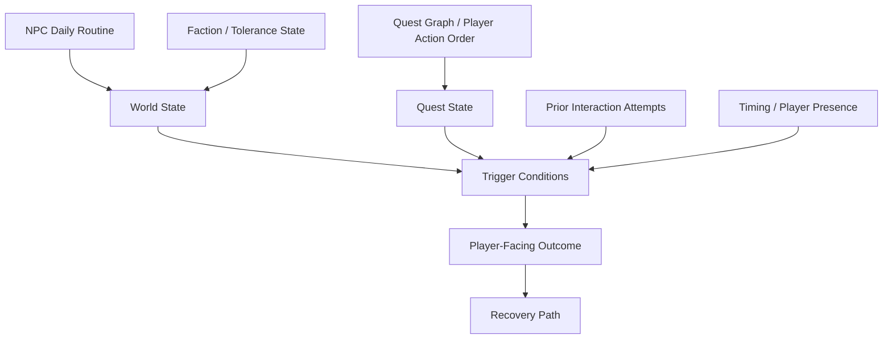

# Commanding Chaos #2
## A QA & Design Investigation into Quest State, NPC Pathing & Systemic Recovery in *Gothic 1 Remake*

**Author:** Marco Trapani  
**Perspective:** QA professional with a Game Design background  
**Case study:** Public QA / Design investigation  
**Reference project:** *Gothic 1 Remake* by Alkimia Interactive

---

# Executive Summary

## The question

**How does a non-linear RPG remain legible when the player can approach its systems in almost any order?**

*Gothic 1 Remake* commits to a world in which NPCs have routines, quests can be approached in different orders, and the player is not constantly guided by quest markers. That freedom is part of the game's identity. It's also what draws me to the Gothic games personally — the world never waits for you or explains itself, and you're dropped into the Colony to work out the rules yourself, the same way the Nameless Hero does.

It also creates a large state space:

```text
Quest State
    +
NPC Routine / Location
    +
Faction State
    +
Previous Interactions
    +
Player Action Order
    +
Timing
    +
Save / Load
    +
Zone Transitions
    ↓
Potential World State
```

The QA challenge is therefore not simply to validate that each quest works on its intended path.

> **The important question is whether the system remains recoverable when the player's path differs from the one the script expected.**

This investigation looks at three player-facing failure families:

1. **NPC arrival state vs. dialogue availability**
2. **Quest-order / precondition handling**
3. **NPC scripted transitions that appear to roll back**

The examples are based on a combination of firsthand gameplay, public community reports and official patch information. Evidence is explicitly labelled. I do not have access to Alkimia's internal build, debug tools, telemetry or implementation, so proposed causes are hypotheses unless directly observable.

---

# 1. Scope & Evidence

## What this is

A QA and Design investigation into state-dependent failures in a released, non-linear RPG.

The focus is not the number of bugs. It is the **failure surface created where multiple systems intersect**:

- NPC daily routines
- quest state and order
- dialogue availability
- faction tolerance / hostility
- scripted NPC movement
- save / load
- zone transitions
- recovery logic

## What this is not

This is not:

- a review of *Gothic 1 Remake*
- a claim about Alkimia's internal implementation or process
- a redesign proposal
- a claim that every reported symptom has the same root cause

The investigation asks a narrower question:

> **Given the design direction the game commits to, where are the highest-risk state transitions, and how would I validate them as a QA professional?**

## Evidence model

| Evidence | Meaning |
|---|---|
| **Firsthand** | Observed during my own playthrough |
| **Community** | Reported by players; useful signal, not proof of root cause |
| **Official** | Supported by official patch/changelog information |
| **Hypothesis** | My technical interpretation of observed behaviour |
| **Confirmation needed** | Requires internal state, logs, telemetry or debugging |

This distinction matters. A strong external investigation should not pretend to know the internal implementation.

This also isn't a scorecard of Alkimia's shipped defects. The goal is to show how I'd approach this kind of system if I were already on the team, using problems the community has already surfaced and that Alkimia's own patch notes show they're actively working through (see Appendix C).

---

# 2. Investigation Method

I use the same loop for each failure:

```text
OBSERVE
  ↓
IDENTIFY PLAYER-FACING FAILURE
  ↓
FORM SYSTEM HYPOTHESIS
  ↓
CLASSIFY RISK
  ↓
IDENTIFY FAILURE MODES
  ↓
DESIGN VALIDATION
  ↓
BUILD REGRESSION COVERAGE
```

The objective is to move from:

> "The NPC won't talk."

to:

> "Which state transition should make the dialogue available, what conditions can prevent that transition, and can the system recover if the player reaches it through another valid order?"

This is particularly important in systemic open worlds because failures often happen **between systems**, rather than inside one isolated feature.

---

# 3. System Model: Where Chaos Comes From

The player experiences one world, but several state machines contribute to it.



The important QA surface is not only each node.

It is the **edges between them**.

For example:

- NPC movement can affect whether dialogue is reachable.
- Quest state can affect which dialogue branch is available.
- Previous interactions can affect faction state.
- A zone transition can interrupt an NPC's scripted state.
- Save/load can preserve or expose an invalid intermediate state.

The player does not experience these as separate modules.

They experience:

> "He won't talk to me."

> "Why are they attacking me?"

> "I completed that quest. Why did nothing happen?"

> "Why is the NPC back where he started?"

That is where systemic QA begins.

---

# 4. Core Design Tension: Freedom vs. Fragility

A Gothic-style world should not hold the player's hand.

If every quest has one route, every NPC waits for the player, and every state is explicitly explained, the world loses part of its identity.

But:

> **Freedom and fragility are not the same thing.**

### Freedom

The player can approach a quest in more than one order and the world adapts.

Example:

```text
Player completes prerequisite
        ↓
Returns to NPC
        ↓
NPC recognises the updated state
        ↓
Correct next interaction becomes available
```

### Fragility

The player takes a valid or plausible alternative route and a handoff silently fails.

```text
Player completes prerequisite
        ↓
Returns to NPC
        ↓
Expected state transition is missed
        ↓
No dialogue / no explanation
        ↓
Player cannot tell whether:
    - they missed something
    - the game missed something
```

The system does not need to support every imaginable order.

It does need to avoid **irreversible, invisible failures at important state transitions**.

---

# 5. Investigation 01 — NPC Pathing & Arrival-Gated Dialogue

## Observation

**Evidence: Firsthand + Community**

Near the waterfall in Chapter 2, Lester is meant to walk into position and then offer a specific line of dialogue.

In my own playthrough, I approached as soon as he was visible. The required dialogue did not appear and Lester remained apparently unresponsive. Waiting for him to physically settle into position allowed the interaction to proceed, matching the community-documented workaround.

## Player-facing failure

The player sees:

> NPC is present → NPC appears idle → required dialogue is unavailable.

The symptom looks like a dialogue problem.

It may actually be a **state synchronisation problem between movement and interaction availability**.

## System hypothesis

One plausible explanation is that dialogue availability depends on an internal arrival / waypoint state that is not synchronised with the NPC's visible position.

This is a hypothesis, not a confirmed implementation detail.

## Risk

**Soft progression block / low observability**

Nothing crashes. The player receives no clear failure signal.

That makes the issue easy to interpret as:

> "Maybe I'm supposed to do something else."

## Failure modes to investigate

- Visual arrival and internal arrival state are out of sync.
- Dialogue availability is checked before the arrival state is committed.
- A failed early interaction has no retry path.
- There is no player-facing distinction between "not ready yet" and "no dialogue available."

## Validation strategy

Test the same interaction across a timing matrix:

| Scenario | Interaction timing |
|---|---|
| A | NPC still travelling |
| B | Immediately on visible arrival |
| C | 2–5 seconds after arrival |
| D | 10+ seconds after arrival |
| E | Different approach angle |
| F | Repeated interaction attempts |

The key question:

> **Does dialogue availability track the NPC's actual state, or can the player enter a false-negative timing window?**

## Regression value

This should become a reusable pattern for other arrival-gated interactions, not just a Lester-specific test.

---

# 6. Investigation 02 — Quest Order, Preconditions & Faction State

This family is more severe because the player can encounter **silent state poisoning**.

## 6.1 Diego / Water Mages' Plan

**Evidence: Firsthand + Community**

I reached the point where the game's handoff should occur and Diego had no relevant dialogue.

Community reports are inconsistent about the exact prerequisite: the general megathread frames the issue around Trial of Fire, while a separate report describes a handoff through Raven after another prior quest.

That disagreement is itself useful QA information:

> **The failure shape is clearer than the exact trigger path.**

My own run confirms the player-facing failure, but does not establish the internal trigger or root cause.

## Player-facing failure

```text
Prerequisite appears complete
        ↓
Player reaches expected NPC
        ↓
No dialogue
        ↓
No explanation
        ↓
Main-path progression can stop
```

## System hypothesis

A plausible model is:

```text
Prerequisite complete
        ↓
Trigger / flag update
        ↓
Dialogue becomes available
```

with a failure somewhere between those states.

Potential causes include:

- a missed precondition update
- an order-dependent trigger
- an earlier interaction changing the expected state
- a trigger that does not retry after being missed

Internal state would be required to distinguish these.

## Risk

**Hard progression blocker / very low observability**

The player may not know what event failed.

---

## 6.2 Water Mages' Sanctuary Hostility

**Evidence: Community**

Players report becoming permanently hostile with sanctuary guards after interacting with the trigger context more than once or approaching it out of the intended order.

One detailed community report identifies the flag:

`GuardPassageWaterMagesWarning_NC`

The reported failure leaves the player hostile with no in-game recovery; the reported workaround involves externally editing the save.

I treat the flag identification as community evidence, not internal confirmation.

## Why this case is especially interesting

The important QA signal is not merely:

> "The guards attack."

It is:

> **A prior interaction can apparently create a persistent state that becomes visible much later, after the causal connection is no longer obvious to the player.**

That is a classic systemic-risk pattern.

## Hypothesis

A trigger may depend on a precondition that is expected to resolve through one canonical interaction path.

Potential failure modes:

- repeated interaction changes state unexpectedly
- an early attempt prevents the later canonical trigger
- the state transition is not idempotent
- no recovery transition exists once the state becomes invalid

Again, the exact root cause requires internal investigation.

---

# 7. The QA Pattern: Adversarial Order Testing

For non-linear quest systems, testing only the intended order is insufficient.

I would build an **adversarial-order matrix** around every high-impact handoff:

| Variation | Example |
|---|---|
| Intended order | Complete A → interact with B |
| Early interaction | Interact with B before A |
| Repeated interaction | B → B → A → B |
| Partial completion | Start A → leave → B |
| Alternate route | Complete A through another valid chain |
| Timing variation | Immediate vs delayed interaction |
| Save/load | Save before / during / after transition |
| Zone transition | Leave area between trigger stages |

The objective is not to test every possible player path.

It is to identify **state transitions where an unexpected order can make the system permanently or invisibly invalid**.

---

# 8. Investigation 03 — NPC State Reset Presented as Progress Loss

## Observation

**Evidence: Community**

In Chapter 5, Stone is scripted to escape his cell and move toward the Swamp Camp.

Community reports describe a sequence in which:

```text
Stone leaves cell
      ↓
Escape appears to progress
      ↓
Stone reappears in original cell
```

A reported workaround involves travelling to the Swamp Camp and sleeping, after which Stone can appear correctly.

A smaller-scale pattern has also been reported with escort NPCs teleporting back toward the player instead of continuing their intended movement.

## System hypothesis

One plausible explanation is a recovery mechanism that restores an NPC to a previous valid state when a scripted transition fails to complete.

That would be a reasonable safety mechanism from a systems perspective.

The player-facing result is problematic because:

> **A recovery system can look identical to lost progression.**

## Risk

**High trust impact / potentially recoverable**

The player sees an explicit progression event and then observes the world apparently undo it.

That can create a much broader perception:

> "If this state rolled back, can I trust anything else I just did?"

## Failure modes

- Zone handoff is not confirmed before fallback logic activates.
- The watchdog cannot distinguish "transition in progress" from "transition failed."
- Save/load captures an intermediate state.
- Recovery happens silently.
- There is no player-facing indication that the system reverted an NPC.

## Validation strategy

Test every scripted NPC transition across zone boundaries with:

- normal completion
- player interruption
- delayed follow-up
- save/load during transition
- save/load immediately after transition
- zone exit/re-entry
- repeated transition attempts

Validate **state**, not just position.

---

# 9. Risk Model

Rather than ranking bugs by intuition, I would evaluate systemic failures against explicit dimensions.

| Dimension | Question |
|---|---|
| **Progression impact** | Can the player continue? |
| **Recoverability** | Can the state recover without reload / external intervention? |
| **Player awareness** | Does the player know that something failed? |
| **Persistence** | Does save/load preserve the invalid state? |
| **Scope** | Is the failure isolated or shared across systems? |
| **Reproduction** | Can QA reproduce it deterministically? |
| **Regression potential** | Could a fix affect other quests or NPC states? |

Applied qualitatively:

| Failure family | Progression | Recoverability | Awareness | Main QA concern |
|---|---|---|---|---|
| Lester arrival/dialogue | Medium | High | Low | Timing window |
| Diego handoff | High | Low / unknown | Very low | Missed precondition |
| Sanctuary hostility | High | Very low | Very low | Persistent state poisoning |
| Stone transition | Medium–High | Medium / unknown | Very low | Silent rollback |

This avoids treating "most severe" as a subjective label. The risk comes from the properties of the failure.

---

# 10. What I Would Validate First

The highest-value coverage would target **irreversible or player-invisible state changes**.

### Priority test families

**1. State poisoning**

Repeated or early interactions that can permanently alter faction / quest state.

**2. Main-path handoffs**

Prerequisite completion → NPC recognition → next quest.

**3. Scripted transitions**

NPC state changes across movement, zones and save/load.

**4. Timing-sensitive interactions**

Dialogue and triggers whose availability depends on NPC movement.

**5. Recovery behaviour**

What happens when a trigger is missed, interrupted or encountered twice?

This is where systemic regression effort gives the most value.

---

# 11. Observability: Turning "Probably" Into "Confirmed"

Without internal tooling, some of the hypotheses above cannot be proven.

If I had access to the team's debug environment, I would want to expose the minimum state necessary to reconstruct a failure.

## Dialogue / trigger

- dialogue availability changes
- trigger accepted / rejected / blocked
- prior interaction count
- relevant flag state before / after interaction

## NPC movement

- waypoint completion event
- movement state: en route / arrived / blocked
- timestamp of visual arrival vs internal ready state

## Quest / faction

- quest precondition state
- faction tolerance / hostility state
- state transition history
- save/load events around the transition

## Scripted transitions

- transition initiated
- transition in progress
- transition completed
- transition reverted
- reason for fallback / watchdog activation

## Reproduction

- save-state snapshots
- repeatable scenario setup
- event timeline export

The goal is not to remove unpredictability from the game.

> **The goal is to make unpredictability investigable.**

---

# 12. Test Strategy & Regression Coverage

The three examples map to three different dimensions of systemic coverage.

### TC-PTH-ARR-001 — Arrival-Gated Dialogue Timing

**Feature:** NPC pathing / dialogue availability  
**Type:** Scenario / Systemic QA  
**Risk:** Medium

**Preconditions**

- NPC has scripted arrival point.
- Dialogue depends on arrival state.

**Steps**

1. Approach before arrival.
2. Attempt dialogue immediately on visible arrival.
3. Attempt dialogue after 5+ seconds.
4. Repeat from a different approach angle.
5. Repeat after save/load where applicable.

**Expected**

Dialogue availability follows the intended internal state without an exploitable false-negative window.

**Coverage rationale**

Covers **timing variance + spatial approach + state synchronisation**.

---

### TC-QST-ORD-001 — Quest Handoff After Prerequisite Completion

**Feature:** Quest-order / precondition handling  
**Type:** Functional / Systemic QA  
**Risk:** High

**Steps**

1. Complete prerequisite.
2. Immediately attempt handoff.
3. Repeat after a delay.
4. Attempt the handoff once before prerequisite completion.
5. Complete prerequisite and retry.
6. Repeat after save/load.

**Expected**

The intended handoff succeeds after prerequisite completion regardless of an earlier harmless interaction attempt. No permanent lockout is created.

**Coverage rationale**

Covers **order variance + retry semantics + persistence**.

---

### TC-NPC-RST-001 — Scripted NPC Zone Transition

**Feature:** NPC state / zone transition  
**Type:** Scenario / Systemic QA  
**Risk:** High

**Steps**

1. Trigger transition.
2. Save/load during transition.
3. Leave and re-enter the relevant zone.
4. Wait for normal completion.
5. Compare final NPC state against intended end-state.

**Expected**

The transition either completes correctly or fails into a recoverable state. It must not silently present a reverted state as completed progression.

**Coverage rationale**

Covers **transition interruption + persistence + recovery behaviour**.

---

# 13. Example Bug Report

## Diego fails to offer "The Plan of the Water Mages" after the relevant Chapter 3 progression

**Environment**

- Single-player campaign
- Chapter 3
- Reproducibility: firsthand once; community reports indicate repeated occurrences
- Exact trigger rate: unconfirmed

### Observed

After reaching the reported progression point, Diego had no relevant dialogue available.

### Expected

Once the relevant prerequisite state is complete, Diego should expose the next intended progression interaction.

### Important uncertainty

Community reports disagree on the exact prerequisite chain. My own reproduction confirms the player-facing failure but does not establish the internal trigger.

### Reproduction Steps

1. Complete the Chapter 3 prerequisite quest chain — reported inconsistently as Trial of Fire or as a hand-off through Raven; not yet established which is the actual trigger.
2. Return to Diego's usual location.
3. Attempt to initiate dialogue.
4. Observe available dialogue options, if any.
5. Repeat after a deliberate delay, and again after reloading a save from before the prerequisite completed, to check whether timing or save state changes the outcome.

### Data I would request

- prerequisite quest state before / after completion
- Diego dialogue availability state
- prior Diego interaction history
- relevant quest / faction flags
- save/load events around the transition

### Impact

**Severity:** High

Main-path progression blocker with no known in-game workaround at time of writing. This can weaken:

- trust that quest completion is being tracked correctly
- willingness to continue without checking a guide first
- perceived reliability of every other quest handoff in the game
- confidence that non-linear play is actually supported, not just tolerated

### Investigation direction

I would keep the defect as an individual ticket while investigating whether it shares infrastructure with other precondition / retry failures.

> **I would not assume a shared root cause until internal evidence confirms it.**

---

# 14. What I Would Do If I Joined the Team

The most useful outcome of an external investigation is not the diagnosis.

It is knowing how to turn it into production work.

## 1. Reproduce

Establish deterministic reproduction for each reported state failure.

- isolate the minimum sequence
- identify required previous interactions
- establish timing sensitivity
- establish save/load sensitivity

## 2. Instrument

Expose the relevant state transitions.

- quest state
- dialogue trigger
- NPC movement state
- faction flags
- transition / recovery events

## 3. Map dependencies

Identify whether apparently different bugs share:

- the same trigger framework
- the same quest-state dependency
- the same recovery mechanism
- the same NPC state system

Do not assume shared root cause before confirming it.

## 4. Build adversarial regression coverage

For high-risk quest handoffs:

```text
INTENDED
EARLY
REPEATED
INTERRUPTED
DELAYED
ALTERNATE ORDER
SAVE / LOAD
ZONE TRANSITION
```

## 5. Protect the player-facing state

Where appropriate, distinguish:

- valid "not ready yet"
- invalid / missed trigger
- recoverable interrupted state
- completed progression

The exact fallback is a design decision.

The QA responsibility is to make sure the system's failure modes are understood, reproducible and recoverable where the design requires it.

## 6. Regression after the fix

A systemic fix should trigger broader regression than the original ticket suggests.

For example, changing quest precondition retry behaviour could affect:

- other quest handoffs
- dialogue availability
- faction state
- save compatibility
- NPC routines
- previously completed content

That is where systemic QA provides value beyond reproducing the original bug.

---

# 15. The Broader QA Lesson

The important lesson from these examples is not:

> "Gothic 1 Remake has bugs."

Every large systemic game does.

The useful question is:

> **Which design decisions increase the number of states QA has to reason about, and where can those states become invisible or irreversible to the player?**

For a non-linear, NPC-driven RPG, I would pay particular attention to:

```text
PLAYER FREEDOM
      ↓
MORE POSSIBLE ORDERS
      ↓
MORE STATE COMBINATIONS
      ↓
MORE SYSTEM INTERSECTIONS
      ↓
GREATER RISK OF INVISIBLE FAILURE
```

The answer is not necessarily to reduce player freedom.

It is to make the underlying systems more resilient.

---

# Conclusion

The hardest part of a non-linear, NPC-driven world is not making each quest work on its own.

It is making the **handoffs between systems** survive contact with a player who was never going to follow the one path the system expected.

A good QA strategy therefore does more than verify the happy path.

It asks:

- What happens if the player arrives early?
- What happens if they arrive twice?
- What happens if they do things in another order?
- What happens if they interrupt a transition?
- What happens after save/load?
- What happens when a trigger is missed?
- Can the system recover?
- And, critically, **will the player understand what happened?**

The world should feel unpredictable.

> **It should never feel unaware of itself.**

---

# Technical Appendix

## A. Test Case ID Legend

| Segment | Meaning |
|---|---|
| `TC` | Test Case |
| `PTH` | Pathing / arrival-gating |
| `QST` | Quest-order / precondition |
| `NPC` | NPC state / transition |
| `001` | Progressive number |

## B. Full Risk Checklist

| Area | Risk | Player Impact | QA Focus |
|---|---|---|---|
| NPC pathing | Arrival-gated dialogue misses window | Confusing silence | Timing / waypoint tests |
| Quest preconditions | Handoff fails to propagate | Progression block | Order-of-operations regression |
| Faction state | Early / repeated interaction poisons state | Silent persistent hostility | Adversarial-order testing |
| Scripted transitions | NPC reverts state | Reads as lost progress | Zone-handoff consistency |
| Player feedback | Failure is invisible | Player cannot self-diagnose | Readability / recovery pass |

## C. Patch Status

Checked against every official patch released since launch, current as of the September 14, 2026 hotfix (build CL 173255) [5][6][7][8]. Status should be re-verified against the changelog immediately before external publication.

- **Patch 1.0.4** (July 31, 2026) includes two Chapter 5 fixes involving Stone directly: a corrected daily routine after he is imprisoned during the quest "The Path Chosen," and a fix ensuring his cell door closes properly if it was already open before imprisonment. Both plausibly overlap with the reported escape/reset symptom — same NPC, same prison-state logic — but neither patch note names the specific "escapes toward the Swamp Camp, then reappears in his cell" sequence the community describes. Treated as a partial, unconfirmed overlap, not a confirmed fix.
- The same patch's Chapter 4 fix for "'Escape Plan' continuing even if you saved all of them" is a different quest entirely — Syra and Velaya's Old Camp escape line — and does not appear related to Stone's Chapter 5 sequence, despite the similar name.
- Neither Patch 1.0.5 (mid-August 2026) nor its September 14 hotfix names Lester, Diego, "The Plan of the Water Mages," or the sanctuary hostility flag. Patch 1.0.5's fixes are concentrated on combat, movement and stability issues elsewhere in the game.
- Investigations 01 and 02 are therefore treated as still open. Investigation 03 is treated as an unconfirmed partial fix at best. Assuming a fix exists when it doesn't — or flagging something already resolved — misrepresents the current build, which is worse than being a few patches behind.

No internal confirmation is claimed for the remaining hypotheses.

---

# Sources

[1] Steam Community — *Known Bugs, Quest Blocks & Workarounds*  
https://steamcommunity.com/app/1297900/discussions/0/573793023877450186/

[2] Steam Community — *The watermagicans' plan quest bug and NPC BUG*  
https://steamcommunity.com/app/1297900/discussions/2/563659002336104149/

[3] Steam Community — *I can't play anymore* — sanctuary hostility report and community flag identification  
https://steamcommunity.com/app/1297900/discussions/2/564785190210172210/

[4] Gamerant — *Gothic 1 Remake Water Mages' Plan Bug — How to Reach Saturas*

[5] Alkimia Interactive — official Patch 1.0.4 changelog  
https://files.gothic-game.com/changelogs/G1R_Patch_1.0.4.txt

[6] Alkimia Interactive — official Patch 1.0.5 changelog  
https://files.gothic-game.com/changelogs/G1R_Patch_1.0.5.txt

[7] Steam News — *Gothic 1 Remake — Patch 1.0.5 Is Live!*  
https://store.steampowered.com/news/app/1297900/view/696522455474241885

[8] vgtimes — September 14, 2026 hotfix report  
https://vgtimes.com/gaming-news/167614-gothic-1-remake-gets-hotfix-1.0.5-with-stability-fixes-and-crash-repairs.html

---

## Evidence note

All observations, hypotheses, QA risks, validation strategies and test cases are presented as the author's professional interpretation. Firsthand observations are explicitly distinguished from community reports and official documentation. Internal implementation details are not claimed where they cannot be verified externally.
